# Agent Workflow Quality status

> Generated deterministically from task front matter. Do not edit this file directly.
> Status records coordination progress; it is not evidence that product behavior is accepted.

## Portfolio overview

**33 ARs tracked** across 3 active status categories.

| Status | Meaning | Count |
| --- | --- | ---: |
| **In progress** | Claimed work with a live lease | 2 |
| **Open** | Dependency-ready and available to claim | 0 |
| **Blocked** | Cannot proceed until its recorded blocker clears | 0 |
| **Planned** | Defined work awaiting promotion or dependencies | 2 |
| **Future** | Deferred roadmap work | 0 |
| **Done** | Accepted, integrated, and durably verified | 29 |
| **Cancelled** | Stopped with a recorded rationale | 0 |
| **Superseded** | Replaced by another AR | 0 |

## Dependency graph

Arrows point from each prerequisite to the work that depends on it. Color is redundant
with the status text inside every node; the tables below are the complete text
alternative.

```mermaid
flowchart LR
    subgraph series_00["00 - Coordination foundation"]
        direction TB
        AR_0001["AR-0001 - Done"]:::status_done
        AR_0002["AR-0002 - Done"]:::status_done
        AR_0003["AR-0003 - Done"]:::status_done
        AR_0004["AR-0004 - Done"]:::status_done
        AR_0005["AR-0005 - Done"]:::status_done
        AR_0006["AR-0006 - Done"]:::status_done
        AR_0007["AR-0007 - Done"]:::status_done
        AR_0008["AR-0008 - Done"]:::status_done
        AR_0009["AR-0009 - Done"]:::status_done
        AR_0010["AR-0010 - Done"]:::status_done
        AR_0011["AR-0011 - Done"]:::status_done
        AR_0012["AR-0012 - Done"]:::status_done
        AR_0013["AR-0013 - Done"]:::status_done
        AR_0014["AR-0014 - Done"]:::status_done
        AR_0015["AR-0015 - Done"]:::status_done
        AR_0016["AR-0016 - Done"]:::status_done
        AR_0017["AR-0017 - Done"]:::status_done
        AR_0018["AR-0018 - Done"]:::status_done
        AR_0019["AR-0019 - Done"]:::status_done
        AR_0020["AR-0020 - Done"]:::status_done
        AR_0021["AR-0021 - Done"]:::status_done
        AR_0022["AR-0022 - Done"]:::status_done
        AR_0023["AR-0023 - Done"]:::status_done
        AR_0024["AR-0024 - Done"]:::status_done
        AR_0025["AR-0025 - Done"]:::status_done
        AR_0026["AR-0026 - Done"]:::status_done
        AR_0027["AR-0027 - Done"]:::status_done
        AR_0028["AR-0028 - Done"]:::status_done
        AR_0029["AR-0029 - Done"]:::status_done
        AR_0030["AR-0030 - In progress"]:::status_in_progress
        AR_0031["AR-0031 - In progress"]:::status_in_progress
        AR_0032["AR-0032 - Planned"]:::status_planned
        AR_0033["AR-0033 - Planned"]:::status_planned
    end
    AR_0001 --> AR_0002
    AR_0001 --> AR_0003
    AR_0001 --> AR_0004
    AR_0001 --> AR_0006
    AR_0001 --> AR_0008
    AR_0001 --> AR_0009
    AR_0001 --> AR_0010
    AR_0001 --> AR_0011
    AR_0001 --> AR_0019
    AR_0001 --> AR_0020
    AR_0001 --> AR_0023
    AR_0002 --> AR_0023
    AR_0003 --> AR_0006
    AR_0003 --> AR_0023
    AR_0004 --> AR_0008
    AR_0004 --> AR_0009
    AR_0004 --> AR_0012
    AR_0004 --> AR_0013
    AR_0004 --> AR_0014
    AR_0004 --> AR_0015
    AR_0004 --> AR_0019
    AR_0004 --> AR_0020
    AR_0005 --> AR_0008
    AR_0006 --> AR_0026
    AR_0006 --> AR_0027
    AR_0006 --> AR_0028
    AR_0007 --> AR_0011
    AR_0008 --> AR_0010
    AR_0012 --> AR_0019
    AR_0012 --> AR_0020
    AR_0013 --> AR_0019
    AR_0013 --> AR_0020
    AR_0014 --> AR_0019
    AR_0014 --> AR_0020
    AR_0015 --> AR_0019
    AR_0015 --> AR_0020
    AR_0018 --> AR_0005
    AR_0019 --> AR_0005
    AR_0020 --> AR_0018
    AR_0020 --> AR_0021
    AR_0020 --> AR_0022
    AR_0021 --> AR_0018
    AR_0022 --> AR_0018
    AR_0023 --> AR_0007
    AR_0023 --> AR_0024
    AR_0023 --> AR_0025
    AR_0024 --> AR_0007
    AR_0024 --> AR_0025
    AR_0025 --> AR_0007
    AR_0029 --> AR_0030
    AR_0029 --> AR_0031
    AR_0029 --> AR_0032
    AR_0030 --> AR_0033
    AR_0031 --> AR_0032
    AR_0032 --> AR_0033
    classDef status_in_progress fill:#1565c0,color:#ffffff,stroke:#263238,stroke-width:2px
    classDef status_open fill:#2e7d32,color:#ffffff,stroke:#263238,stroke-width:2px
    classDef status_blocked fill:#c62828,color:#ffffff,stroke:#263238,stroke-width:2px
    classDef status_planned fill:#6a1b9a,color:#ffffff,stroke:#263238,stroke-width:2px
    classDef status_future fill:#455a64,color:#ffffff,stroke:#263238,stroke-width:2px
    classDef status_done fill:#00695c,color:#ffffff,stroke:#263238,stroke-width:2px
    classDef status_cancelled fill:#616161,color:#ffffff,stroke:#263238,stroke-width:2px
    classDef status_superseded fill:#5d4037,color:#ffffff,stroke:#263238,stroke-width:2px
```

### Accessible dependency index

| AR | Prerequisites | Dependents |
| --- | --- | --- |
| [AR-0001](tasks/AR-0001.md) | None | [AR-0002](tasks/AR-0002.md), [AR-0003](tasks/AR-0003.md), [AR-0004](tasks/AR-0004.md), [AR-0006](tasks/AR-0006.md), [AR-0008](tasks/AR-0008.md), [AR-0009](tasks/AR-0009.md), [AR-0010](tasks/AR-0010.md), [AR-0011](tasks/AR-0011.md), [AR-0019](tasks/AR-0019.md), [AR-0020](tasks/AR-0020.md), [AR-0023](tasks/AR-0023.md) |
| [AR-0002](tasks/AR-0002.md) | [AR-0001](tasks/AR-0001.md) | [AR-0023](tasks/AR-0023.md) |
| [AR-0003](tasks/AR-0003.md) | [AR-0001](tasks/AR-0001.md) | [AR-0006](tasks/AR-0006.md), [AR-0023](tasks/AR-0023.md) |
| [AR-0004](tasks/AR-0004.md) | [AR-0001](tasks/AR-0001.md) | [AR-0008](tasks/AR-0008.md), [AR-0009](tasks/AR-0009.md), [AR-0012](tasks/AR-0012.md), [AR-0013](tasks/AR-0013.md), [AR-0014](tasks/AR-0014.md), [AR-0015](tasks/AR-0015.md), [AR-0019](tasks/AR-0019.md), [AR-0020](tasks/AR-0020.md) |
| [AR-0005](tasks/AR-0005.md) | [AR-0018](tasks/AR-0018.md), [AR-0019](tasks/AR-0019.md) | [AR-0008](tasks/AR-0008.md) |
| [AR-0006](tasks/AR-0006.md) | [AR-0001](tasks/AR-0001.md), [AR-0003](tasks/AR-0003.md) | [AR-0026](tasks/AR-0026.md), [AR-0027](tasks/AR-0027.md), [AR-0028](tasks/AR-0028.md) |
| [AR-0007](tasks/AR-0007.md) | [AR-0023](tasks/AR-0023.md), [AR-0024](tasks/AR-0024.md), [AR-0025](tasks/AR-0025.md) | [AR-0011](tasks/AR-0011.md) |
| [AR-0008](tasks/AR-0008.md) | [AR-0001](tasks/AR-0001.md), [AR-0004](tasks/AR-0004.md), [AR-0005](tasks/AR-0005.md) | [AR-0010](tasks/AR-0010.md) |
| [AR-0009](tasks/AR-0009.md) | [AR-0001](tasks/AR-0001.md), [AR-0004](tasks/AR-0004.md) | None |
| [AR-0010](tasks/AR-0010.md) | [AR-0001](tasks/AR-0001.md), [AR-0008](tasks/AR-0008.md) | None |
| [AR-0011](tasks/AR-0011.md) | [AR-0001](tasks/AR-0001.md), [AR-0007](tasks/AR-0007.md) | None |
| [AR-0012](tasks/AR-0012.md) | [AR-0004](tasks/AR-0004.md) | [AR-0019](tasks/AR-0019.md), [AR-0020](tasks/AR-0020.md) |
| [AR-0013](tasks/AR-0013.md) | [AR-0004](tasks/AR-0004.md) | [AR-0019](tasks/AR-0019.md), [AR-0020](tasks/AR-0020.md) |
| [AR-0014](tasks/AR-0014.md) | [AR-0004](tasks/AR-0004.md) | [AR-0019](tasks/AR-0019.md), [AR-0020](tasks/AR-0020.md) |
| [AR-0015](tasks/AR-0015.md) | [AR-0004](tasks/AR-0004.md) | [AR-0019](tasks/AR-0019.md), [AR-0020](tasks/AR-0020.md) |
| [AR-0016](tasks/AR-0016.md) | None | None |
| [AR-0017](tasks/AR-0017.md) | None | None |
| [AR-0018](tasks/AR-0018.md) | [AR-0020](tasks/AR-0020.md), [AR-0021](tasks/AR-0021.md), [AR-0022](tasks/AR-0022.md) | [AR-0005](tasks/AR-0005.md) |
| [AR-0019](tasks/AR-0019.md) | [AR-0001](tasks/AR-0001.md), [AR-0004](tasks/AR-0004.md), [AR-0012](tasks/AR-0012.md), [AR-0013](tasks/AR-0013.md), [AR-0014](tasks/AR-0014.md), [AR-0015](tasks/AR-0015.md) | [AR-0005](tasks/AR-0005.md) |
| [AR-0020](tasks/AR-0020.md) | [AR-0001](tasks/AR-0001.md), [AR-0004](tasks/AR-0004.md), [AR-0012](tasks/AR-0012.md), [AR-0013](tasks/AR-0013.md), [AR-0014](tasks/AR-0014.md), [AR-0015](tasks/AR-0015.md) | [AR-0018](tasks/AR-0018.md), [AR-0021](tasks/AR-0021.md), [AR-0022](tasks/AR-0022.md) |
| [AR-0021](tasks/AR-0021.md) | [AR-0020](tasks/AR-0020.md) | [AR-0018](tasks/AR-0018.md) |
| [AR-0022](tasks/AR-0022.md) | [AR-0020](tasks/AR-0020.md) | [AR-0018](tasks/AR-0018.md) |
| [AR-0023](tasks/AR-0023.md) | [AR-0001](tasks/AR-0001.md), [AR-0002](tasks/AR-0002.md), [AR-0003](tasks/AR-0003.md) | [AR-0007](tasks/AR-0007.md), [AR-0024](tasks/AR-0024.md), [AR-0025](tasks/AR-0025.md) |
| [AR-0024](tasks/AR-0024.md) | [AR-0023](tasks/AR-0023.md) | [AR-0007](tasks/AR-0007.md), [AR-0025](tasks/AR-0025.md) |
| [AR-0025](tasks/AR-0025.md) | [AR-0023](tasks/AR-0023.md), [AR-0024](tasks/AR-0024.md) | [AR-0007](tasks/AR-0007.md) |
| [AR-0026](tasks/AR-0026.md) | [AR-0006](tasks/AR-0006.md) | None |
| [AR-0027](tasks/AR-0027.md) | [AR-0006](tasks/AR-0006.md) | None |
| [AR-0028](tasks/AR-0028.md) | [AR-0006](tasks/AR-0006.md) | None |
| [AR-0029](tasks/AR-0029.md) | None | [AR-0030](tasks/AR-0030.md), [AR-0031](tasks/AR-0031.md), [AR-0032](tasks/AR-0032.md) |
| [AR-0030](tasks/AR-0030.md) | [AR-0029](tasks/AR-0029.md) | [AR-0033](tasks/AR-0033.md) |
| [AR-0031](tasks/AR-0031.md) | [AR-0029](tasks/AR-0029.md) | [AR-0032](tasks/AR-0032.md) |
| [AR-0032](tasks/AR-0032.md) | [AR-0029](tasks/AR-0029.md), [AR-0031](tasks/AR-0031.md) | [AR-0033](tasks/AR-0033.md) |
| [AR-0033](tasks/AR-0033.md) | [AR-0030](tasks/AR-0030.md), [AR-0032](tasks/AR-0032.md) | None |

## Complete AR inventory

### In progress (2)

| Priority | AR | Owner | Summary | Next action |
| --- | --- | --- | --- | --- |
| P1 | [AR-0030](tasks/AR-0030.md): Terminology registry and enforcement | codex-awq-ar0030-terminology | Add reusable canonical-vocabulary declarations and deterministic terminology enforcement. | Add hostile coverage for canonical collisions and future-dated exceptions, regenerate the expected provenance fixture, then rerun focused and full gates. |
| P1 | [AR-0031](tasks/AR-0031.md): Formal-model adapter profile | codex-awq-ar0031-formal-adapter | Add a bounded formal-model execution adapter with truthful evidence output. | Rerun the complete suite through uv --directory so cwd and venv tool discovery match the documented gate, retaining explicit second-disk TMPDIR, cache, Python, coverage, and external-tool paths. |

### Planned (2)

| Priority | AR | Owner | Summary | Next action |
| --- | --- | --- | --- | --- |
| P1 | [AR-0032](tasks/AR-0032.md): Native-gate and requirement mapping contracts | Unclaimed | Bind AWQ requirements to existing native gates without duplicating or weakening them. | Design native-gate mapping schema and implement validation, evidence normalization, and equivalence fixtures. |
| P2 | [AR-0033](tasks/AR-0033.md): Agent-ready quality integration workflow | Unclaimed | Publish a complete agent-ready workflow for adopting AWQ while retaining native gates. | Generate and test the end-to-end agent integration recipe after terminology and mapping contracts stabilize. |

### Done (29)

| Priority | AR | Owner | Summary | Next action |
| --- | --- | --- | --- | --- |
| P0 | [AR-0001](tasks/AR-0001.md): Bootstrap Agent Workflow Quality | Unclaimed |  Published AWQ v0.1.0 and integrated its pinned shadow policy across all four target repositories.  | No further bootstrap action; select and promote a dependency-ready planned AR through the coordinator. |
| P0 | [AR-0017](tasks/AR-0017.md): State coordinator v0.3.1 and source-header compliance | Unclaimed | Sync immutable coordinator v0.3.2 and enforce Huawei/MIT headers on state-owned source files. | Sync and verify coordinator v0.3.2, then implement state-owned header policy and run focused and full gates. |
| P1 | [AR-0002](tasks/AR-0002.md): Standards traceability and control catalogue | Unclaimed | Make every AWQ requirement traceable to versioned external controls without overstating certification. | Commit the verified v0.2.0 candidate, publish its pull request, merge after green checks, release, and fresh-clone verify. |
| P1 | [AR-0003](tasks/AR-0003.md): Policy governance and exception lifecycle | Unclaimed | Harden weakening detection, exception approval, repository rules and ownership boundaries. | Decompose semantic policy diff, exception expiry, CODEOWNERS and GitHub ruleset enforcement. |
| P1 | [AR-0004](tasks/AR-0004.md): Python shell documentation and schema adapters | Unclaimed | Turn baseline format checks into composable first-class adapters with pinned tool contracts. | Run final gate, build and wheel smoke; audit, sign and publish the v0.4.0 candidate. |
| P1 | [AR-0005](tasks/AR-0005.md): Rust and Android JVM assurance profiles | Unclaimed | Add deep ecosystem gates for the two compiled stacks used by the initial consumers. | Umbrella acceptance verified; close AR-0005 and select the next dependency-ready P1 AR. |
| P1 | [AR-0007](tasks/AR-0007.md): Reproducible releases SBOM and provenance | Unclaimed | Harden AWQ distribution with reproducibility, SBOM, attestations and verified update metadata. | Complete and release the deterministic-artifact, SPDX SBOM and signed-provenance/update children, then verify umbrella acceptance. |
| P1 | [AR-0008](tasks/AR-0008.md): Consumer equivalence and enforcement promotion | Unclaimed | Measure shadow results across all four consumers and safely promote proven shared gates. | Define an equivalence corpus, mismatch taxonomy, observation period and per-consumer promotion decisions. |
| P1 | [AR-0012](tasks/AR-0012.md): Pinned Python quality adapters | Unclaimed | Published AWQ v0.5.0 with reviewed opt-in Python quality adapters and normalized remediation evidence. | No further AR-0012 action; select the next dependency-ready adapter family. |
| P1 | [AR-0013](tasks/AR-0013.md): Pinned shell quality adapters | Unclaimed | Published AWQ v0.6.0 with reviewed opt-in ShellCheck, shfmt and Bats adapters plus atomic checksum-pinned acquisition. | No further AR-0013 action; select the next dependency-ready adapter family. |
| P1 | [AR-0014](tasks/AR-0014.md): Pinned documentation quality adapters | Unclaimed | Published AWQ v0.7.0 with reviewed offline rumdl and Vale documentation adapters, bounded tracked-format selection, and checksum-pinned acquisition. | No further AR-0014 action; select the next dependency-ready adapter family. |
| P1 | [AR-0015](tasks/AR-0015.md): Pinned schema quality adapters | Unclaimed | Implement JSON, YAML and JSON Schema adapters on the shared contract. | Add strict parser and schema-validation adapters with duplicate-key and draft/version fixtures. |
| P1 | [AR-0016](tasks/AR-0016.md): Huawei and MIT source-header compliance | Unclaimed | Enforce exact Huawei 2026 and SPDX MIT headers across first-party AWQ source files. | Register the established SSH signing key with GitHub, review and merge product PR 4, then sync state-vendored coordinator source only from a released upstream version. |
| P1 | [AR-0018](tasks/AR-0018.md): Pinned Rust assurance profile and adapters | Unclaimed | Add reviewed Rust formatting, lint, dependency, compatibility and advanced test evidence contracts. | Complete and release the three Rust child ARs, then verify the combined profile acceptance. |
| P1 | [AR-0019](tasks/AR-0019.md): Pinned Android and JVM assurance profile and adapters | Unclaimed | Add reviewed Gradle, Kotlin, Android lint, dependency, ABI and UI-boundary evidence contracts. | Release verification complete; close AR-0019 and verify the AR-0005 umbrella acceptance. |
| P1 | [AR-0020](tasks/AR-0020.md): Pinned Rust stable PR gates | Unclaimed | Add exact stable-toolchain formatting, Clippy, build, documentation and test contracts. | Create the signed DCO commit, publish its PR, and verify exact-head CI. |
| P1 | [AR-0021](tasks/AR-0021.md): Pinned Rust supply and API compatibility gates | Unclaimed | Add dependency policy, advisory and public API compatibility contracts for Rust projects. | Implement after stable Rust PR contracts define the toolchain and fixture boundary. |
| P1 | [AR-0023](tasks/AR-0023.md): Deterministic release artifacts and manifest | Unclaimed | Make wheel and source builds reproducible and bind them to a canonical offline-verifiable release manifest. | Promote and implement the deterministic build recipe, manifest schema, generator, verifier and hostile fixtures. |
| P1 | [AR-0024](tasks/AR-0024.md): Canonical SPDX SBOM and license inventory | Unclaimed | Generate deterministic release SBOMs that identify AWQ, build inputs, licenses and artifact relationships. | Implement after AR-0023 fixes the release-manifest and artifact identity contracts. |
| P1 | [AR-0025](tasks/AR-0025.md): Signed provenance trust roots and verified updates | Unclaimed | Bind release provenance to trusted identities and require verified local bundles before consumer lock updates. | Implement after AR-0023 and AR-0024 stabilize artifact and SBOM identities. |
| P1 | [AR-0029](tasks/AR-0029.md): Formal syntax and evidence contracts | Unclaimed | Make formal-language checks precise and formal-evidence claims structured and truthful. | Coordinator independently reviews exact-head PR 26 at 89bc34e529c9dc77523a0316501eb255c3c43c8e; merge and release only after that review. |
| P2 | [AR-0006](tasks/AR-0006.md): Formal evidence and refactoring assurance | Unclaimed | Model stateful quality semantics and add behavior-preserving refactoring evidence contracts. | Identify safety invariants, bounded models, counterexample fixtures and refactoring equivalence strategies. |
| P2 | [AR-0009](tasks/AR-0009.md): Property fuzz mutation and adversarial testing | Unclaimed | Expand hostile testing beyond curated fixtures to generated and mutation-based assurance. | Select bounded generators and mutation operators for paths, policies, schemas, workflows and redaction. |
| P2 | [AR-0010](tasks/AR-0010.md): Performance flake and evidence-retention budgets | Unclaimed | Define scalable runtime, determinism, flake and privacy-preserving retention budgets. | Establish representative repository-size fixtures and decompose performance, flake and retention controls. |
| P2 | [AR-0011](tasks/AR-0011.md): Agent onboarding distribution and compatibility | Unclaimed | Make AWQ easy for new agents to adopt, update and diagnose across supported environments. | Design compatibility metadata, agent-readable recipes, migration fixtures and package distribution channels. |
| P2 | [AR-0022](tasks/AR-0022.md): Bounded Rust coverage fuzz and mutation evidence | Unclaimed | Add bounded coverage, fuzzing and mutation contracts with explicit corpus, time and platform limits. | Push signed commit e32c5a3, open the PR, and verify hosted exact-head CI. |
| P2 | [AR-0026](tasks/AR-0026.md): Formal policy lifecycle and concurrency models | Unclaimed | Extend bounded formal assurance to policy updates, exception renewal, tier transitions, freshness, rollback and concurrent crash recovery. | Define the finite lifecycle state, interleavings, recovery assumptions and counterexample corpus. |
| P2 | [AR-0027](tasks/AR-0027.md): Formal implementation refinement contracts | Unclaimed | Bind bounded AWQ models to reviewed implementation refinement maps without overstating formal proof. | Define refinement-map schema, correspondence obligations, executable trace checks and hostile mismatch fixtures. |
| P2 | [AR-0028](tasks/AR-0028.md): Language-specific refactoring evidence adapters | Unclaimed | Add reviewed collectors/adapters for language-specific characterization, differential, property and mutation evidence. | Select first supported language, define pinned tool and native-equivalence contracts, then add hostile fixtures. |
