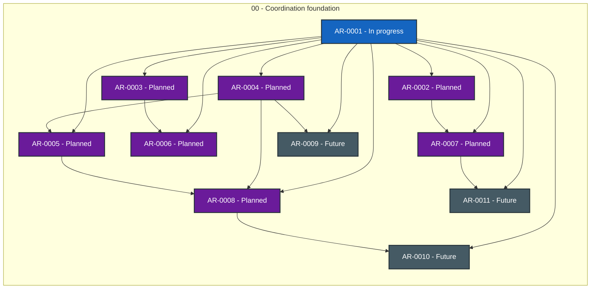

# Agent Workflow Quality status

> Generated deterministically from task front matter. Do not edit this file directly.
> Status records coordination progress; it is not evidence that product behavior is accepted.

## Portfolio overview

**11 ARs tracked** across 3 active status categories.

| Status | Meaning | Count |
| --- | --- | ---: |
| **In progress** | Claimed work with a live lease | 1 |
| **Open** | Dependency-ready and available to claim | 0 |
| **Blocked** | Cannot proceed until its recorded blocker clears | 0 |
| **Planned** | Defined work awaiting promotion or dependencies | 7 |
| **Future** | Deferred roadmap work | 3 |
| **Done** | Accepted, integrated, and durably verified | 0 |
| **Cancelled** | Stopped with a recorded rationale | 0 |
| **Superseded** | Replaced by another AR | 0 |

## Dependency graph

Arrows point from each prerequisite to the work that depends on it. Color is redundant
with the status text inside every node; the tables below are the complete text
alternative.

### Accessible dependency index

| AR | Prerequisites | Dependents |
| --- | --- | --- |
| [AR-0001](tasks/AR-0001.md) | None | [AR-0002](tasks/AR-0002.md), [AR-0003](tasks/AR-0003.md), [AR-0004](tasks/AR-0004.md), [AR-0005](tasks/AR-0005.md), [AR-0006](tasks/AR-0006.md), [AR-0007](tasks/AR-0007.md), [AR-0008](tasks/AR-0008.md), [AR-0009](tasks/AR-0009.md), [AR-0010](tasks/AR-0010.md), [AR-0011](tasks/AR-0011.md) |
| [AR-0002](tasks/AR-0002.md) | [AR-0001](tasks/AR-0001.md) | [AR-0007](tasks/AR-0007.md) |
| [AR-0003](tasks/AR-0003.md) | [AR-0001](tasks/AR-0001.md) | [AR-0006](tasks/AR-0006.md) |
| [AR-0004](tasks/AR-0004.md) | [AR-0001](tasks/AR-0001.md) | [AR-0005](tasks/AR-0005.md), [AR-0008](tasks/AR-0008.md), [AR-0009](tasks/AR-0009.md) |
| [AR-0005](tasks/AR-0005.md) | [AR-0001](tasks/AR-0001.md), [AR-0004](tasks/AR-0004.md) | [AR-0008](tasks/AR-0008.md) |
| [AR-0006](tasks/AR-0006.md) | [AR-0001](tasks/AR-0001.md), [AR-0003](tasks/AR-0003.md) | None |
| [AR-0007](tasks/AR-0007.md) | [AR-0001](tasks/AR-0001.md), [AR-0002](tasks/AR-0002.md) | [AR-0011](tasks/AR-0011.md) |
| [AR-0008](tasks/AR-0008.md) | [AR-0001](tasks/AR-0001.md), [AR-0004](tasks/AR-0004.md), [AR-0005](tasks/AR-0005.md) | [AR-0010](tasks/AR-0010.md) |
| [AR-0009](tasks/AR-0009.md) | [AR-0001](tasks/AR-0001.md), [AR-0004](tasks/AR-0004.md) | None |
| [AR-0010](tasks/AR-0010.md) | [AR-0001](tasks/AR-0001.md), [AR-0008](tasks/AR-0008.md) | None |
| [AR-0011](tasks/AR-0011.md) | [AR-0001](tasks/AR-0001.md), [AR-0007](tasks/AR-0007.md) | None |

## Complete AR inventory

### In progress (1)

| Priority | AR | Owner | Summary | Next action |
| --- | --- | --- | --- | --- |
| P0 | [AR-0001](tasks/AR-0001.md): Bootstrap Agent Workflow Quality | codex-awq-bootstrap-20260908 |  Published AWQ v0.1.0 and integrated its pinned shadow policy across all four target repositories.  |  Wait for exact ASB attestation head post-main quality, Rust and emulated-aarch64 runs; then finish consumer and root coordination audits.  |

### Planned (7)

| Priority | AR | Owner | Summary | Next action |
| --- | --- | --- | --- | --- |
| P1 | [AR-0002](tasks/AR-0002.md): Standards traceability and control catalogue | Unclaimed | Make every AWQ requirement traceable to versioned external controls without overstating certification. | Decompose control-source ingestion, mapping review, generated matrices and drift detection. |
| P1 | [AR-0003](tasks/AR-0003.md): Policy governance and exception lifecycle | Unclaimed | Harden weakening detection, exception approval, repository rules and ownership boundaries. | Decompose semantic policy diff, exception expiry, CODEOWNERS and GitHub ruleset enforcement. |
| P1 | [AR-0004](tasks/AR-0004.md): Python shell documentation and schema adapters | Unclaimed | Turn baseline format checks into composable first-class adapters with pinned tool contracts. | Decompose one child AR per adapter family and define portable evidence normalization. |
| P1 | [AR-0005](tasks/AR-0005.md): Rust and Android JVM assurance profiles | Unclaimed | Add deep ecosystem gates for the two compiled stacks used by the initial consumers. | Decompose Rust and Android JVM implementations after adapter contracts from AR-0004 stabilize. |
| P1 | [AR-0007](tasks/AR-0007.md): Reproducible releases SBOM and provenance | Unclaimed | Harden AWQ distribution with reproducibility, SBOM, attestations and verified update metadata. | Design the release manifest and decompose reproducibility, SBOM, provenance and update verification. |
| P1 | [AR-0008](tasks/AR-0008.md): Consumer equivalence and enforcement promotion | Unclaimed | Measure shadow results across all four consumers and safely promote proven shared gates. | Define an equivalence corpus, mismatch taxonomy, observation period and per-consumer promotion decisions. |
| P2 | [AR-0006](tasks/AR-0006.md): Formal evidence and refactoring assurance | Unclaimed | Model stateful quality semantics and add behavior-preserving refactoring evidence contracts. | Identify safety invariants, bounded models, counterexample fixtures and refactoring equivalence strategies. |

### Future (3)

| Priority | AR | Owner | Summary | Next action |
| --- | --- | --- | --- | --- |
| P2 | [AR-0009](tasks/AR-0009.md): Property fuzz mutation and adversarial testing | Unclaimed | Expand hostile testing beyond curated fixtures to generated and mutation-based assurance. | Select bounded generators and mutation operators for paths, policies, schemas, workflows and redaction. |
| P2 | [AR-0010](tasks/AR-0010.md): Performance flake and evidence-retention budgets | Unclaimed | Define scalable runtime, determinism, flake and privacy-preserving retention budgets. | Establish representative repository-size fixtures and decompose performance, flake and retention controls. |
| P2 | [AR-0011](tasks/AR-0011.md): Agent onboarding distribution and compatibility | Unclaimed | Make AWQ easy for new agents to adopt, update and diagnose across supported environments. | Design compatibility metadata, agent-readable recipes, migration fixtures and package distribution channels. |
